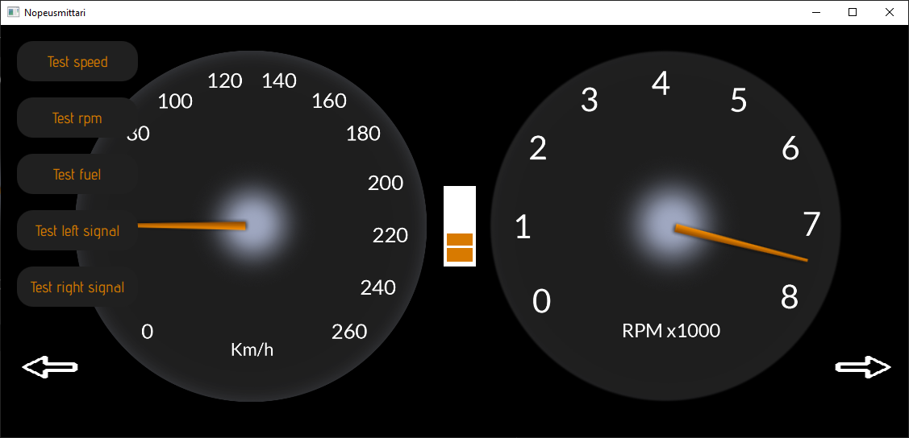

<h1 align="center">Auton Kojelautanäyttö Qt</h1>

<!-- Status -->

<h4 align="center">
	🏫  School 🚧 Project...
</h4>

&#xa0;

<a href="https://tuni-my.sharepoint.com/:v:/g/personal/roni_niemi_tuni_fi/EcrZPvyFKppKvSIm2ksanDcBYZ7dGWPLQ1DkBUywjjQPrg?e=qjku8t">Screencast</a>

## About

Kojelautanäytöstä löytyy nopeus-, kierros- ja bensamittari, myös vilkkujen merkkivalot löytyvät. Jokaisen elementin toimintaa voi testata ”test” painikkeilla.
